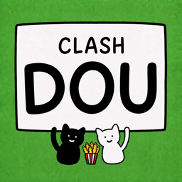
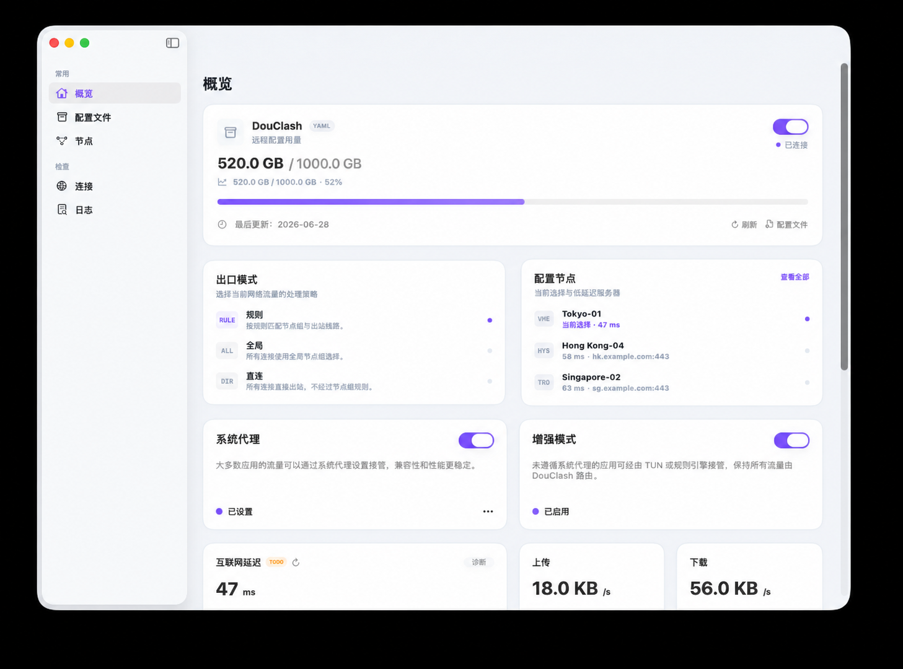

# DouClash

  <a href="README.md">简体中文</a> | <strong>English</strong>

  

DouClash is a native macOS graphical application for running, managing, and monitoring a local [mihomo](https://github.com/MetaCubeX/mihomo) core.

## Features

- Start and stop the local mihomo core, and manage subscriptions and local YAML configurations.
- View core status, routing mode, proxy nodes, system proxy settings, enhanced (TUN) mode, and real-time traffic statistics from the overview page.
- Inspect active connections, client traffic rankings, and upload/download speed charts.
- Switch between direct, rule-based, and global routing modes.
- Enable or disable the system proxy, TUN mode, LAN access, and other network options.

## Documentation

For development, building, packaging, and implementation details, see:

[Development guide (Chinese)](docs/development.md)

For design research and implementation decisions, see:

- [Configuration switching (Chinese)](docs/切换配置.md)
- [Logging (Chinese)](docs/日志.md)

## References and Acknowledgements

Some product behavior, configuration management, logging, and macOS integration decisions in DouClash were informed by and compared against the following open-source projects:

- [mihomo](https://github.com/MetaCubeX/mihomo): the proxy core run and managed by this project.
- [ClashX.Meta](https://github.com/MetaCubeX/ClashX.Meta): referenced for its macOS menu bar, configuration switching, system proxy, and privileged helper designs.
- [Kumo](https://github.com/ProjectKumo/KumoApp): referenced for its Profile model, managed runtime configuration, logging, and layered core lifecycle design.
- [Clash Party / Mihomo Party](https://github.com/mihomo-party-org/clash-party): referenced for its Profile switching, runtime configuration generation, hot reload, and failure rollback strategies.

Copyright and licenses for these projects belong to their respective owners. "Referenced" here means they were used for design research, behavior comparison, and implementation decision-making. Unless otherwise stated, this repository does not claim to copy or redistribute their source code.

## License

DouClash is licensed under the
[GNU General Public License v3.0 only](LICENSE). Third-party components
distributed with the project remain subject to their respective licenses; see
[Third-Party Notices](THIRD_PARTY_NOTICES.md) for details.

## Disclaimer

- All code in this project has been generated or modified with the participation of AI Agents.
- This project is provided "AS IS", without warranties of any kind, express or implied.
- You are solely responsible for any consequences of using this project, including but not limited to network disruptions, account risks, data loss, configuration errors, or system failures.
- The author is not liable for any direct, indirect, incidental, special, or consequential damages.
- To keep the development process consistent, the author recommends contributing code generated or modified by AI Agents rather than handwritten code.
